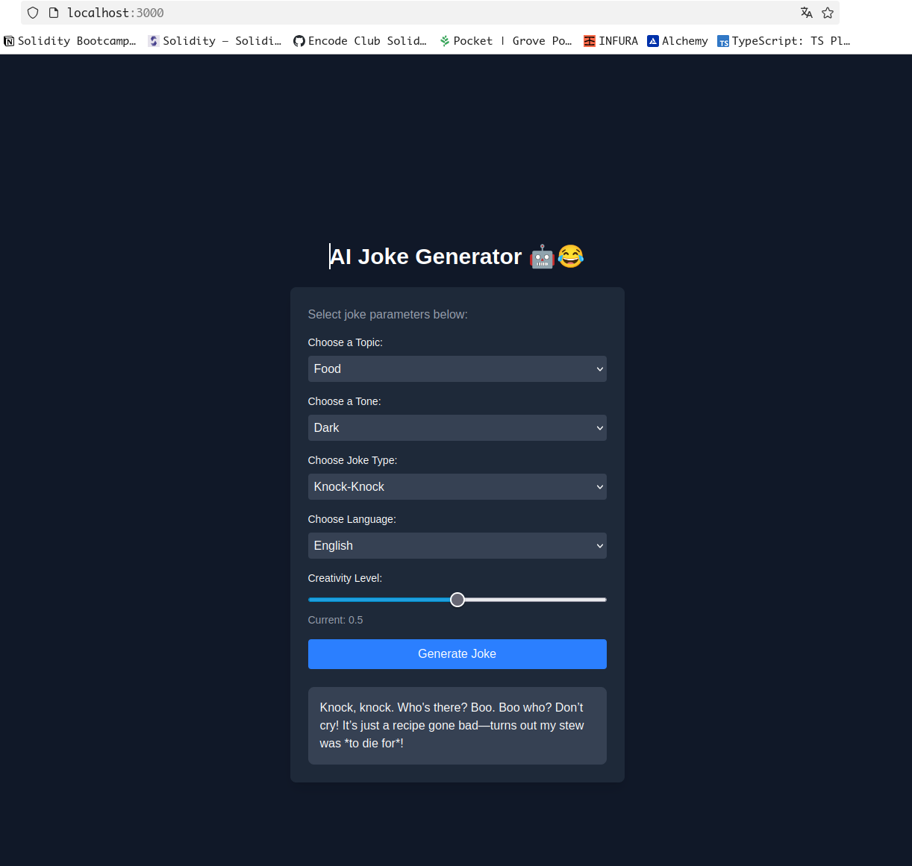
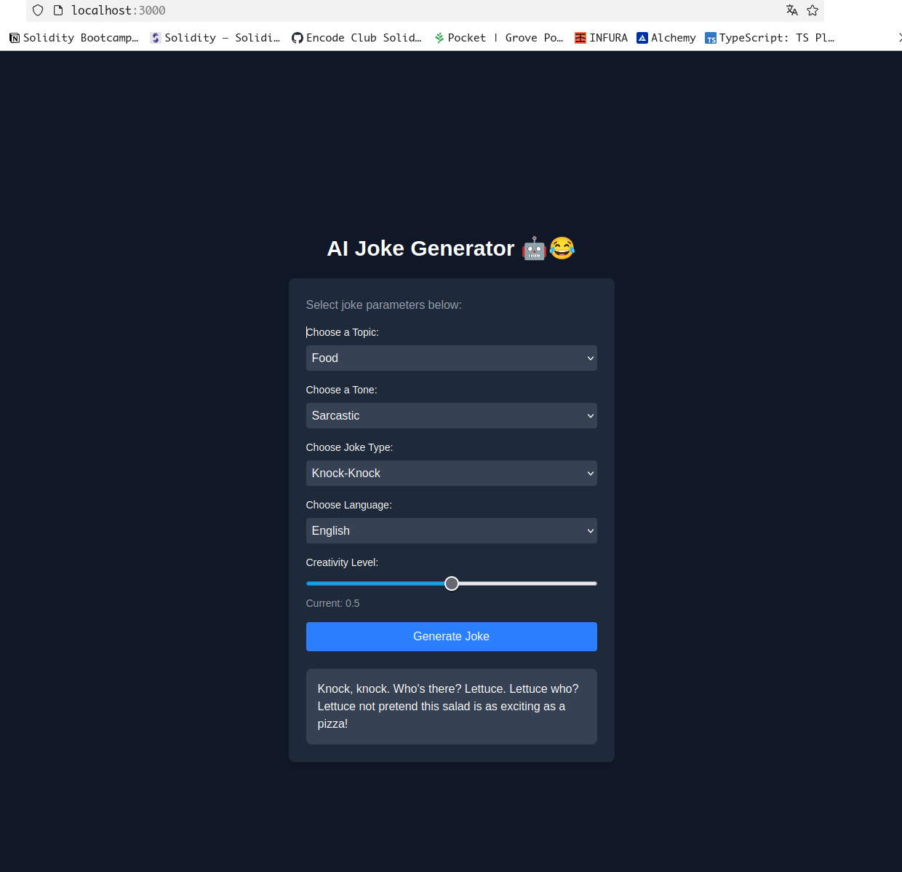
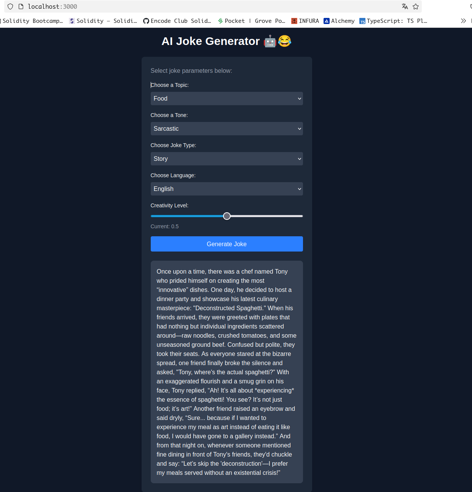
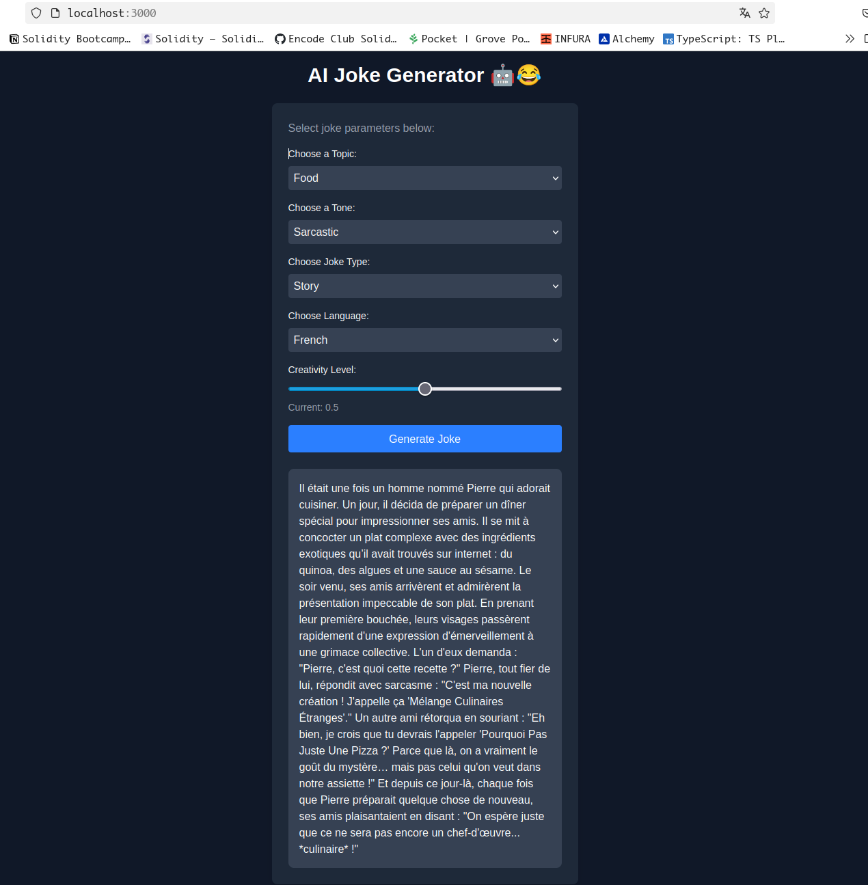
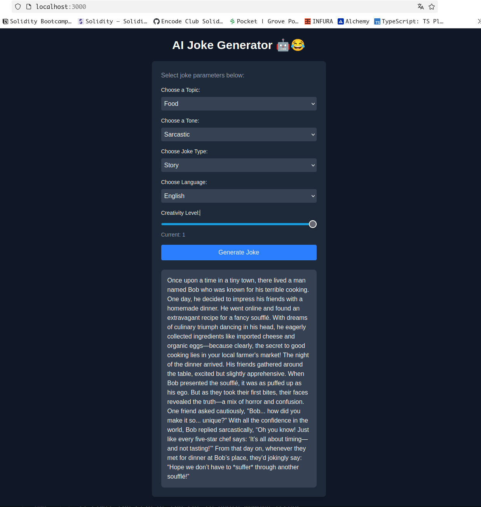

# AI Joke Generator Test Report

This document details the testing results for the AI Joke Generator application. The tests cover various combinations of joke parameters including **Joke Topic**, **Joke Tone**, **Joke Type**, **Language**, and **Creativity Level**.

---

## Table of Contents

- [Test Overview](#test-overview)
- [Test Scenarios](#test-scenarios)
  - [Test Scenario 1: Basic Joke Generation](#test-scenario-1-basic-joke-generation)
  - [Test Scenario 2: Variation in Joke Tone](#test-scenario-2-variation-in-joke-tone)
  - [Test Scenario 3: Variation in Joke Type](#test-scenario-3-variation-in-joke-type)
  - [Test Scenario 4: Language Variations](#test-scenario-4-language-variations)
  - [Test Scenario 5: Creativity Level Adjustments](#test-scenario-5-creativity-level-adjustments)
- [Conclusion](#conclusion)
- [Appendix](#appendix)

---

## Test Overview

- **Application Name:** AI Joke Generator
- **Purpose:** To generate jokes based on different input parameters.
- **Test Parameters:**
  - **Joke Topic:** e.g., animals, technology, food, etc.
  - **Joke Tone:** e.g., humorous, sarcastic, dry, etc.
  - **Joke Type:** e.g., pun, one-liner, anecdote, etc.
  - **Language:** e.g., English, Spanish, etc.
  - **Creativity Level:** e.g., low, medium, high

---

## Test Scenarios

### Test Scenario 1: Basic Joke Generation

**Parameters:**
- **Joke Topic:** *Food*
- **Joke Tone:** *Dark*
- **Joke Type:** *Knock-Knock*
- **Language:** *English*
- **Creativity Level:** *0.5*

**Screenshot:**

---

### Test Scenario 2: Variation in Joke Tone

**Parameters:**
- **Joke Topic:** *Food*
- **Joke Tone:** *Sarcastic*
- **Joke Type:** *Knock-Knock*
- **Language:** *English*
- **Creativity Level:** *[0.5]*

**Screenshot:**

---

### Test Scenario 3: Variation in Joke Type

**Parameters:**
- **Joke Topic:** *Food*
- **Joke Tone:** *Sarcastic*
- **Joke Type:** *Story*
- **Language:** *English*
- **Creativity Level:** *0.5*

**Screenshot:**

---

### Test Scenario 4: Language Variations

**Parameters:**
- **Joke Topic:** *Food*
- **Joke Tone:** *Sarcastic*
- **Joke Type:** *Story*
- **Language:** *French*
- **Creativity Level:** *0.5*

**Screenshot:**

---

### Test Scenario 5: Creativity Level Adjustments

**Parameters:**
- **Joke Topic:** *Food*
- **Joke Tone:** *Sarcastic*
- **Joke Type:** *Story*
- **Language:** *English*
- **Creativity Level:** *1*

**Screenshot:**

---

## Conclusion

The app works fine, different combined parameters are giving different results as shown in the screenshots.

---

## Appendix

- **Additional Comments:** *We see that jokes in a different language than yours are usually hard to understand*
- **Future Test Considerations:** *We may want to test humor bias from AI models using different prompts*

